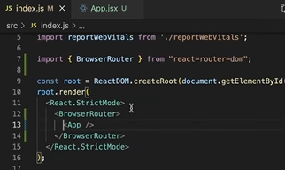

# 15 Agustus 2022 (perkenalan React JS)
## React JS
adalah  framework view library JS untuk membuat tampilan (user interface) pada website

react dibuat oleh faceboook. fb sendiri juga menggunakan react JS

> kenapa kita harus menggunakan React JS?

    dikarenakan pada React js membuat aplikasi front end menjadi lebih cepat walaupun harus mengendel berbagai data 

## React js is modular
kita dapat menerapkan konsep modular js pada react JS. reat js membagi tampilan pada website menjadi kompone komponen kecil 

## react JS is scalable
dimana React JS dapat digunakan pada aplikasi bersekala kecil hingga besar

## React is Popular
komunikasi  react JS di seluruh dunia sangat besar.kebanykan prusahaan teknologipun sudah menggunakan React JS

jadi kita dapat di cari dan mudah untuk mendapatkan pekerjaan, baik itu Freelance ataupun di startup jika menguasain React JS

## sebelum kita melakukan pengoprasian React JS kita harus melakukan penginstalan node js
1. download node js yang terbaru  linnya ( https://modes.org/en.download ) maka akan memunculkan tampilan seperti dibahawa ini :

2. klik Windows instaler makan akan terdownload
3. setelah itu lakukan instal node JS
4. jika sudah maka masuk k CMD dan kita cek NOde dengan printah "node --version"
4.  untuk mengecek NPM gunakan printah "npm --version"
6. maka selanjutnya lakukan intal create React app library dengan printah " npm instal -g create-react-app"
7. membuat folder dengan printah "npx create-react-app [ nama projek kita apa] atau bisa membuat manual langsung  bikin new folder selanjutnya kita melakukan intal librari dari projek yang sudah kita buat dengan printah "npm run start"

npm secara otomatis terinstal saat kita menginstall node JS

tampilan di CMD

maka akan langsung menuju ke prowser react dan bisa  di jalankan 

## Membuat interface menggunakan vanilla js dan DOM
vanillah JS is a anonymous yang artinya kita dapat menggunakan native js (default)

membuat elemen UI dengan menggunakan Vanilla JS

membuat UI Element Dengan React JS

>kenapa ada elemen HTML di JS??

    karena itu adalah JPX. JPX adalah sintax ekstension for javascript,jsx yang di kembangkan untuk menggunakan react js. 

    jsx juga harus di compile untuk menjadi js maka dari itu kita dapat menggunakan html dalam file extension js

## THE VIRTUAL DOM
adalah duplikasi dari real DOM yang Sebenarnya

misalnya kita mempunyai 2 komponen UI dan 1 page, ketika kita ingin mengupdatenya data pada 1 komponen, maka react JS hanya melakuan render uoang pada komponen tersebut

ini yang membuat React JS menjadi lebih cepat dalam performancenya

## class dan className
pada JSX attribut class di tag element HTML harus menggunakan  className berkut adalah contohnya printahnya:

# 16 Agustus 2022 (React JS Component)
adalah salah satu core dari react js. Didalam UI component merupakan satuan satuan kecil, yang artinya dalam 1 page ada beberapa component yang bisa kita buat.

tujuan dibuat component yaitu jika component tersebut bersifat reusable code.

pada skala projek, jika kita membuat component maka komponen tersebut akan dibutuhkan pada section atau page lain. 

## membuat component
ada 2 cara membuat component
1. menggunakan function
2. menggunakan class

namun pada kasus ini documentasi resmi React JS merekomendasikan menggunakan function

cara membuatnya 

1. kita harus membuat project terlebih dahulu dengan printah "npx create-react-app [nama file]"
2. buka projek yang telah dibuat pada VSC
3. jalankan React JS menggunakan printah "npm start" maka tampilan nya akan seperti gambar dibawah ini 

4. membuat component menekan SCR dalam dan membuat component tampilan seperti dibawah ini 

5. buat folder asset dalam src selanjutnya membuat file contoh nama file "avatar.css" sejajar dengan file component (note. nama folder file dan function harus menggunakan huruf besar di awal dan kata selanjutnya)

berikut tampilan export component untuk digunakan pada app js

berikut adalah tampilan ketika app.js di panggil 

6. lakukan kembali langkah 4 dan 5 untuk membuat komponen lain, jika kita ingin melakukan styling halaman course agar sesuai dengan UI wireframe.maka lakukan styling pada halaman tersebut bukan pada komponen avatar, jadi lakukan styling pada apps.css bukan pada avatar app.css

## Perbedaan Functional Component dengan class Component
kedua componen ini,mengasilkan hal yang sama,namun class menggunakan state dan functional menggunakan state hooks. Brikut contoh printahnya:

## stateful component and stateless component
- stateless component

- stateful component

maka data image akan menjadi dinamis sesuai data yang dikirim ke component avatar

 

# 18 Agustus 2022 (state & props )

adalah hal yang berhunungan dengan  stateless dan stateful component

stateless berarti tidak memiliki state. namun dia hanya memiliki props

sedangkan stateful memiliki state dan bisa mengirim state tersebut ke component

jadi state adalah data lokal. namun porps digunakan compoment memiliki data yang dinamis yang dikirim component lain 

alasan kita menggunakan props adalah agar component kita menjadi dinamis

berikut adalah yang harus diperhatikan pada props:

dari gambar diatas yang harus di perhatikan pada props yaitu pada  printah di dalam  ({text, size}) dikarenakan perintak tersebut menjadi tumpuan data yang di tranfer dari 1 komponen ke komponen yang lain contohnya pada gambar diatas.

## styling component
ada beberap cara untuk styling diantaranya :

 1. melakukan import komponen cssnya ke yang membutuhkan dengan printah

    import "./nama-file.css";

2. bisa menggunakan printah 

        const Header ({text, size}) =>{
            const styleHeader = {
            fonsSize = size
            color = blue
    };

3. bisa juga langsung ke style dengan printah 

        <h1 style = {styleHeader} className = "nama yang ada dalam file css"

## bootstrap
ada 2 cara untuk menggunakan bootstrap yaitu:
1. bisa memanggil link bootstrap di publick di dalam index.html  dengan cara copy link boostrap tersebut

2. bisa melakukan download dengan  cara 
    
    - membuat folder baru di public
    - lakukan download di bootsrap " https://boostrap.com"
    - pilih download dan pilih compilet CSS dan JS lalu klik download
    - maka secara otomatis yang di download tadi akan tersimpan pada folder yang kita buat

3. bisa menggunakan install dalam terminal dengan printah

    - npm install bootsrap@5.2.0
    - enter
    - maka boostrap langsung terinstall (pastikan koneksi internet stabil)
    - cara penggunakanya yaitu harus di index.js karena index.js adalah sebagai induk paling utama di dalam projek react ini. dikarenkan 
    dibawahnya pasti menggunakan bootstrap semua
    , maka printah yang digunakan jika kita ingin bootstrap ini sebagai styling global kita dengan memasukan printah pada baris 8 dan 9 seperti pada gambar dibawah ini 

    
# 19 Agustus 2022 ( React liefesyle)

pada kesempanan ini akan membahas bagaimana proses react js akan tampil di web browser kita

seperti pada gambar di atas memiliki 2 fase diantaranya 
1. fase Render

        adalaha untuk proses bagaimana data itu dibentuk sampai di proses ulang kembali 

2. fase commit

        di mana React benar-benar menyentuh DOM dan membuat perubahan . Penting untuk menunjukkan bahwa React mungkin melalui fase render tetapi tidak pernah melakukan. Ini bisa terjadi jika komponen mengembalikan hasil yang sama seperti terakhir kali.

Setiap fase memiliki metodenya sendiri, yang membuatnya lebih mudah untuk melakukan operasi tipikal pada komponen. Dengan komponen berbasis kelas, pengembang React secara langsung memperluas dari React.Componentuntuk mengakses metode

maka dari itu proses functional component melakukan proses yang lebih simpel dibandingkan dengan class component

## constractor
adalah suatu inisialisasi struktur data pada component

Yang di proses  awal dari constractor yaitu 

kemudian akan jalan ke render

lalu setelah itu akan mendalankan function-function pada gambar dibawah ini 

maka tampilan dari contoh printah diatas seperti pada gambar dibawah ini :

dapat kita simpulkan bahwa keuntungan dari functional component yaitu supaya pekekerjaan kita selesai lebih cepat selesai dan lebih simpel 

## instalasi react router

- buka link " https://reactrouter.com/docs/en/v6/getting-started/installation#basic-installation "

- pilih install trus klik basic instalation selanjutnya pilih npm seperti pada gambar dibawah ini 

- link yang ada pada gambar npm kita copy dan masuk ke terminal pada projek yang kita buat lalu klik enter maka tampilan seperti pada gambar dibawah ini  

- tunggu proses loading berjalan dan pastikan koneksi internet bagus dan terhubung 

- selanjutnya kita menuju file  index.js tambahkan printah <i> import { BrowserRouter } from "react-router-dom"; </i>

seperti pada gambar dibawah ini:

- selanjutnya menambahkan 
        
        " <BrowserRouter> "  menjadi perent "   <App /> "
maka tampilanya seperti pada gambar dibawah ini :

